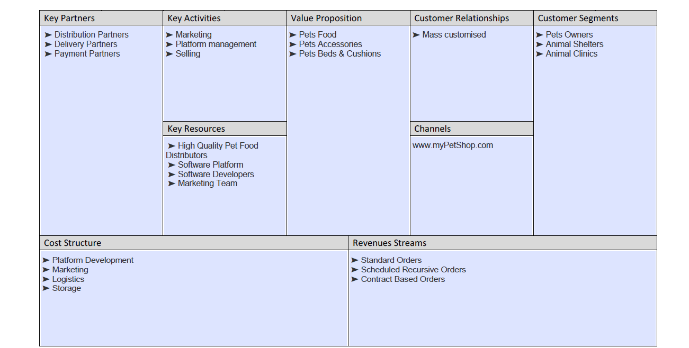
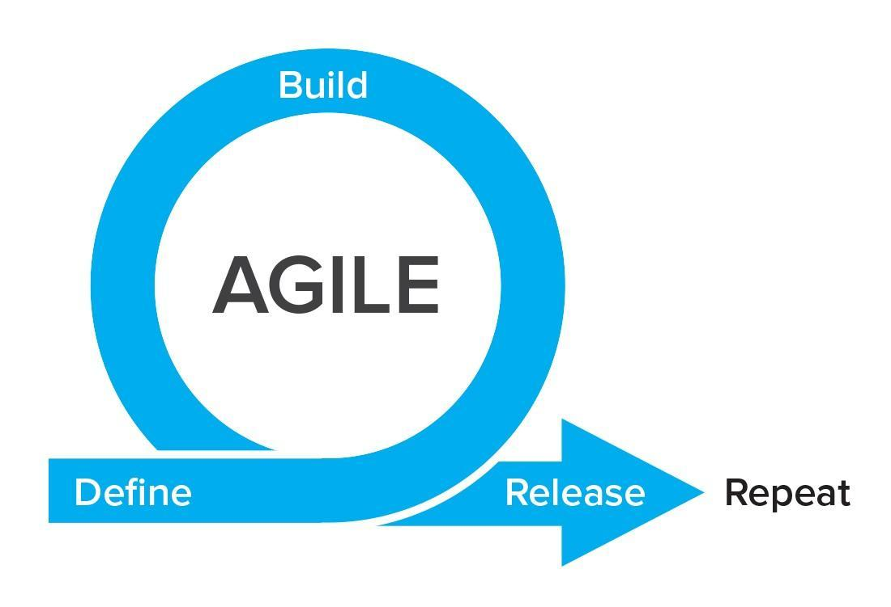
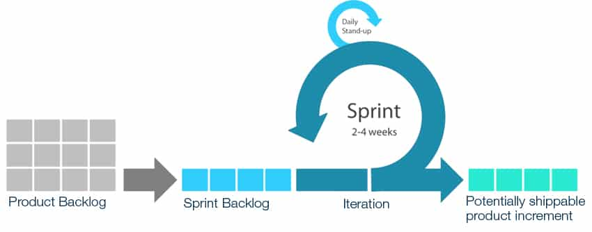

# Pet Shop 
## Grigoras Simona
## Cloud Computing (Faculty of Computer Science Iasi)
 
 ## Google Cloud Platform Setup
   #### Creating a VM instance
   - Click on the navigation menu button on the top left of the console, under “COMPUTE” section, select Compute Engine > VM Instances
   - Click on the create button to proceed with creating an VM instance.
   - Fill in the Name of the instance as per your choice and provide the region and Zone information. Then choose your machine type with the desired CPU and memory.
   - Select the desired OS image (Ubuntu 16.04) and define the disk size
   - In the firewall section, select the “Allow HTTP traffic” and “Allow HTTPS traffic” sections.
   
   #### SSH Login to the Instance
   - To ssh login to your Linux instance, you can login directly through the Google provided ssh “web interface” which can be accessed by clicking on the SSH button of the instance from the console or you can also ssh login remotely through either by using terminal in Linux systems and for windows systems, by a third party tool like “putty”.
   - Key-pair Generation:- To ssh login remotely, first generate a public-private ssh key pair from your terminal by running the command “ssh-keygen” from the terminal. You can also generate the “key-pair” directly on the server by login through the ssh “web interface” of google cloud. 
   The “key pairs” will be found in the users home directory in a hidden directory “.ssh” (path: ~/.ssh/) where “id_rsa” is the private key and “id_rsa.pub” is the public key.
   - Configuring key-pair:- Now to configure ssh remote access, copy the contents of public ssh key to the GCP console. 
   Click on the instance name on the GCP console, click the edit button on the top of the page  and then scroll down to the “SSH Keys” section. 
   Click on the ” Show and edit” drop-down and copy and paste the generated public ssh key in the provided text box space.
   Remember to change the “username@hostname” part at the end of the public key to a “username” that is already present in the instance. 
   Then finally click on save and google will automatically insert the key into the instance for you. Now you will be able to login to the ubuntu instance using the private key.
   (source [cloudkul](https://cloudkul.com/blog/running-compute-engine-vm-on-google-cloud/))
   
   #### LAMP installation on Google Cloud Platform
   - Installing Apache:
   
     ```sudo apt-get -y install apache2```
   - Install php7.0:
     ```
     sudo locale-gen en_US.UTF-8
     export LANG=en_US.UTF-8
     sudo apt-get update
     sudo apt-get install -y software-properties-common python-software-properties
     sudo LC_ALL=en_US.UTF-8 add-apt-repository -y ppa:ondrej/php
     sudo apt-get update
     apt-get -y install php7.0 php7.0-curl php7.0-bcmath php7.0-intl php7.0-gd php7.0-dom php7.0-mcrypt php7.0-iconv php7.0-xsl php7.0-mbstring php7.0-ctype php7.0-zip php7.0-pdo php7.0-xml php7.0-bz2 php7.0-calendar php7.0-exif php7.0-fileinfo php7.0-json php7.0-mysqli php7.0-mysql php7.0-posix php7.0-tokenizer php7.0-xmlwriter php7.0-xmlreader php7.0-phar php7.0-soap php7.0-mysql php7.0-fpm libapache2-mod-php7.0
     sed -i -e"s/^memory_limit\s*=\s*128M/memory_limit = 512M/" /etc/php/7.0/apache2/php.ini
     ```
   - check instalations:
     ```
      apache2 -v
      php -v
     ```
   - Enable apache rewrite and headers module.
     
     ```
      sudo a2enmod rewrite
      sudo a2enmod headers
      sudo service apache2 restart
     ``` 
   - Install mysql-client:
     ```
     sudo apt-get -y install mysql-client
     ``` 
   - check the mysql installation and its version:
     ```
     mysql --version
     ``` 
     
     ##### Creating a MySQL database using SQL service of GCP
     - To create a mysql database using SQL service of GCP, go to Navigation menu  > SQL, click on “create instance”, choose database engine as MySQL and click on next. 
     Choose the use case i.e. for development, staging or production. Here we will choose development.
     - Next in the configure step,  choose Instance Id, Root Password, Region and zone.
     - Click on create button to create the mysql instance
     
     ##### Connecting MySQL Database with VM instance:
     - You need to allow the public IP of the Compute VM, in the firewall rules of the MySQL service. 
     Click on the MySQL database Instance Id that you created and select the Connections Tab, and under the connectivity section, click on “Add network”. 
     Give a name to the network and add the IP of the Compute VM instance in the CIDR format i.e. <ipv4_address>/32 and click on done and save. 
     This will allow the Compute VM instance to connect with the MySQL database instance.
     - To verify that the database is properly authenticated to the MySQL database, ssh login to the Compute VM instance and check if you are connected and able to login to the database instance. 
     For this you need the Public IP of the database instance which you can easily get in the overview section of the MySQL Instance.
     
     ```
     ping  <public_IP_of_MySQL_instance>
     mysql -h <public_IP_of_MySQL_instance> -u root -p
     ```
     (source [cloudkul](https://cloudkul.com/blog/lamp-installation-on-google-cloud/))
     
 ## Implementation
The application is based on php framework Magento ver. 2.2.6

 ## User interaction flow Diagram


 ## Bussiness Canvas Plan
 


 ## Flow description
 The user can access the application without an account. In order to place an order, the user has to create an account.
 After adding products to cart, the user can bisualize his products through minicart or by going on cart page.
 The cart page is the first step of the checkout process. In the next step, a shipping address should be added or selected if it already exists
 in order to calculate the shipping amount. Lats step: choose payment method and place order.
 After placing the order, the customer is redirected to order success page where is displayed the link to the created order in his account
 
 All these actions are structured under the architectural pattern  MVC (Model - View - Controller)

 ## MVC Pattern
 Model–View–Controller (usually known as MVC) is an architectural pattern commonly used for developing user interfaces that divides an application into three interconnected parts. This is done to separate internal representations of information from the ways information is presented to and accepted from the user.[1][2] 
 The MVC design pattern decouples these major components allowing for code reuse and parallel development.
 (source [Wikipedia](https://en.wikipedia.org/wiki/Model%E2%80%93view%E2%80%93controller))


 ## How it's done
### Agile Methodology
The Agile Method is a particular approach to project management that is utilized in software development. This method assists teams in responding to the unpredictability of constructing software. It uses incremental, iterative work sequences that are commonly known as sprints.

The general principles of the Agile Method

1.  Satisfy the client and continually develop software.
2.  Changing requirements are embraced for the client’s competitive advantage.
3.  Concentrate on delivering working software frequently. Delivery preference will be placed on the shortest possible time span.
4.  Developers and business people must work together throughout the entire project.
5.  Projects must be based on people who are motivated. Give them the proper environment and the support that they need. They should be trusted to get their jobs done.
6.  Face-to-face communication is the best way to transfer information to and from a team.
7.  Working software is the primary measurement of progress.
8.  Agile processes will promote development that is sustainable. Sponsors, developers, and users should be able to maintain an indefinite, constant pace.
9.  Constant attention to technical excellence and good design will enhance agility.
10. Simplicity is considered to be the art of maximizing the work that is not done, and it is essential.
11. Self-organized teams usually create the best designs.
12. At regular intervals, the team will reflect on how to become more effective, and they will tune and adjust their behavior accordingly.

 

 ### Scrum Methodology
Scrum is an agile project management methodology or framework used primarily for software development projects with the goal of delivering new software capability every 2-4 weeks. It is one of the approaches that influenced the Agile Manifesto, which articulates a set of values and principles to guide decisions on how to develop higher-quality software faster.
 -  “Scrum Master” – the person who maintains the process
 -  “The Client” 
 -  “The Development Team” – a group of  7-8 persons who analyze, project and implement

In timpul fiecarui “sprint” (de obicei cu o durata de 2-4 sapatamani), echipa creaza un increment ce poate fi livrat. Setul de caracteristici ce intra intr-un “sprint” provin din “backlog”-ul proiectului, care reprezinta un set prioritizat de cerinte de nivel inalt ce trebuiesc realizate.  In timpul unei sedinte de planificare a sprint-ului, se stabilesc cerintele ce vor intra in sprint. Cerintele sunt “inghetate” in timpul unui sprint. Sprint-ul trebuie sa se incheie la timp. Daca cerintele nu sunt implementate complet, ele se intorc in backlog-ul proiectului. Dupa terminarea unui sprint, echipa trebuie sa demonstreze functionarea software-ului.

Organizations that have adopted agile Scrum have experienced:

 - Higher productivity
 - Better-quality products
 - Reduced time to market
 - Improved stakeholder satisfaction
 - Better team dynamics
 - Happier employees
 



